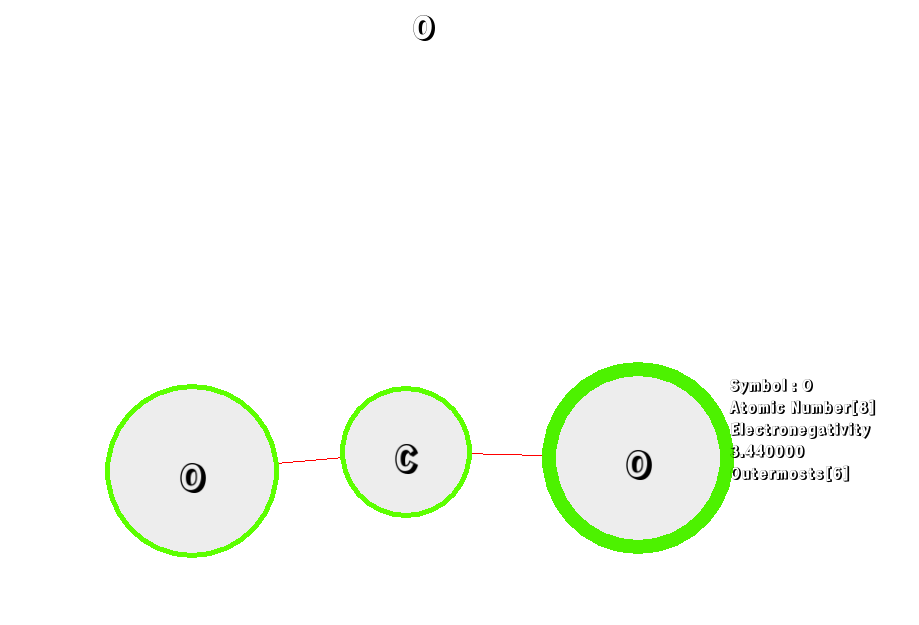

# Lewis 화학식 분해 프로그램

# 작동
식입력  
화학식 분해 후 전기음성도에 상관관계 가진 원자반지름 역수에 맞춰 크기 조정  
출력 후 사용자 입력 가능 상태  

# 실행예


# 사용
처음 프로그램을 시작하였을때 Molecule를 입력받습니다.
```
CH4 + O2
```
방향키(위, 아래, 왼쪽, 오른쪽) 으로 원자를 선택할 수 있습니다.  
``` B ``` 를 누른 상태에서, 방향키를 눌러 결합합니다.  
``` Enter ``` 를 누르면 현재 결합된 분자의 식을 출력합니다.  
``` I ``` 를 누르면 원자의 정보를 나타냅니다.  